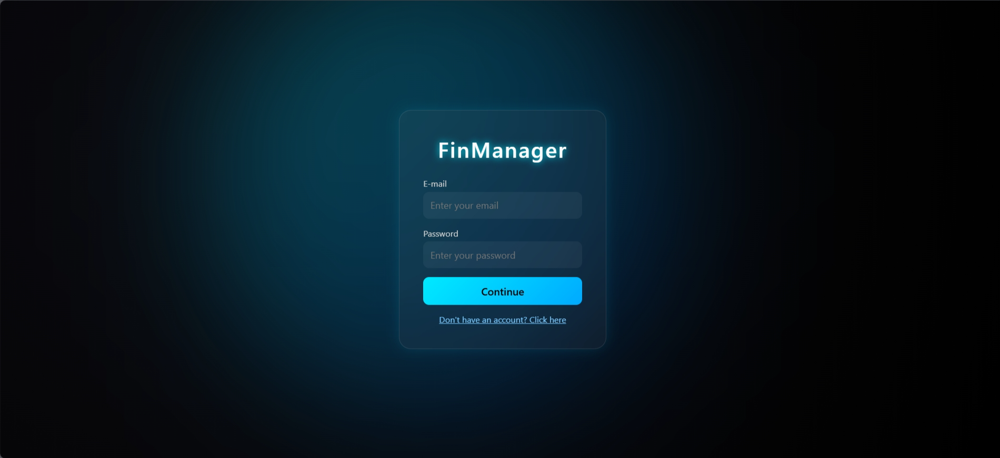
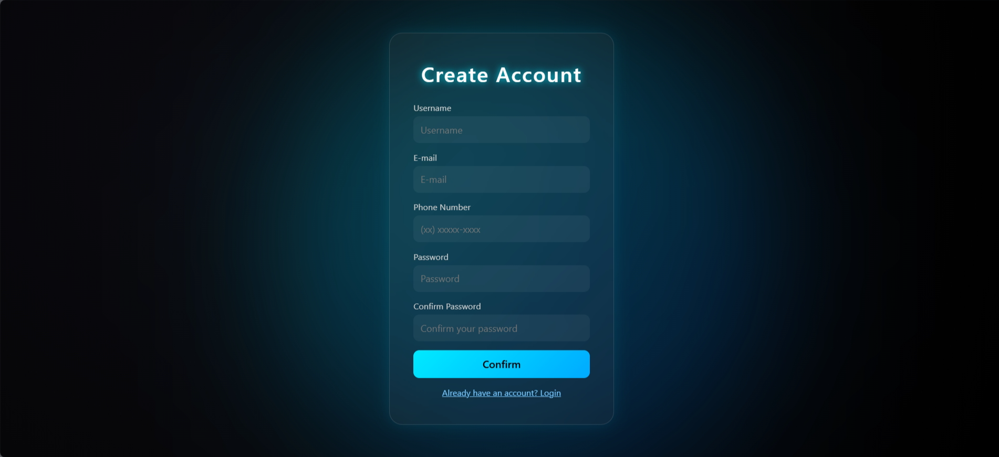
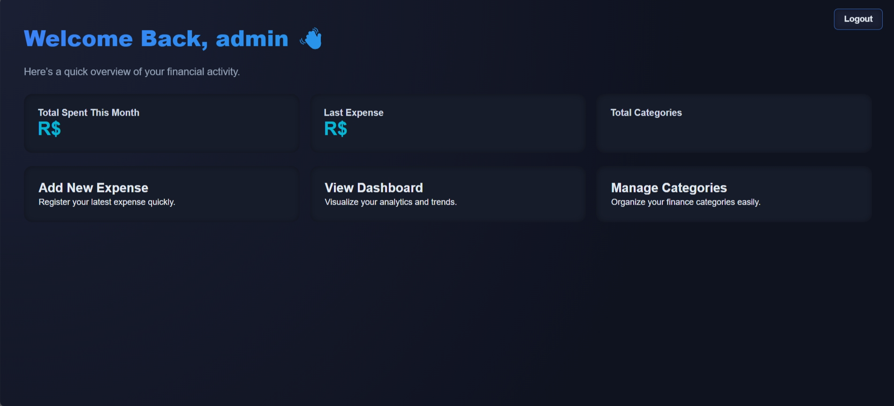
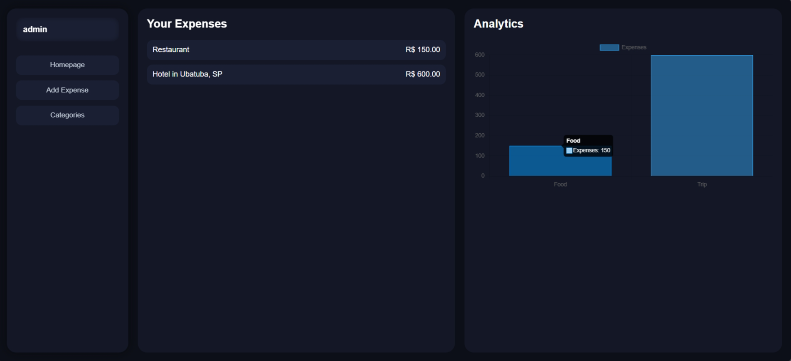
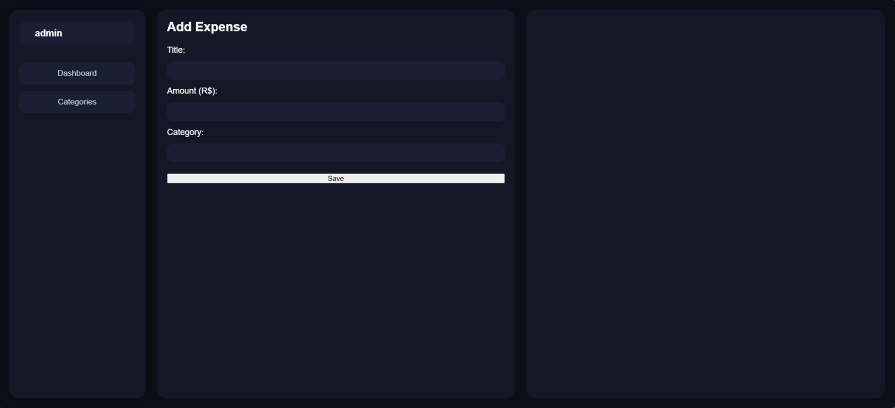

# FinManager

Um sistema de gestão financeira pessoal desenvolvido com Django, com foco em simplicidade, segurança e visual moderno. O projeto ainda está em desenvolvimento, mas já possui estrutura organizada para futuras funcionalidades como controle de gastos, gráficos interativos, login seguro e funcionalidades financeiras mais avançadas (planejadas).

<div style="display: grid; grid-template-columns: repeat(3, 1fr); gap: 10px;">
  
  
  
  
  
</div>

---

## Objetivo do Projeto

O FinManager tem como propósito oferecer uma plataforma de controle financeiro intuitiva e eficiente, permitindo que o usuário acompanhe entradas, saídas, saldo geral e visualize gráficos de desempenho mensal.

---

## 📌 Funcionalidades (atual e futuras)

### ✔ Já implementadas

- Sistema de autenticação (login/logout)
- Estrutura base do layout com sidebar e dashboard
- Organização das rotas e apps

### 🔧 Em desenvolvimento

- Gráficos estatísticos
- Tela de perfil
- Sistema de categorias
- API interna (planejada)

### Futuras melhorias

- Dashboard com IA explicando seus gastos
- Exportação de relatórios (PDF/CSV)
- Modo dark automático

---

## Tecnologias Utilizadas

- **Python 3.12+**
- **Django 5.2**
- **HTML5 / CSS3 / JS**
- **SQLite (dev)**

---

## 📂 Estrutura do Projeto

```
FinManager/
├── finmanager/        # Configurações gerais do Django
├── main/
├── users/             # App de autenticação e perfis
├── dashboard/         # App da homepage e widgets
├── static/            # CSS, JS e imagens
├── templates/         # HTMLs do projeto
└── manage.py
```

---

## Como rodar o projeto

1. **Clone o repositório**:

```
git clone https://github.com/SEU_USUARIO/finmanager.git
cd finmanager
```

2. **Crie o ambiente virtual**:

```
python -m venv venv
venv/scripts/activate
```

3. **Instale as dependências**:

```
pip install -r requirements.txt
```

4. **Execute o servidor**:

```
python manage.py runserver
```

---

## Autor

**Rafael Domiciano Maia Mateus** — Desenvolvedor Web e estudante apaixonado por Python, Django e interfaces modernas.

LinkedIn: [https://www.linkedin.com/in/rafael-maia-26b41a308](https://www.linkedin.com/in/rafael-maia-26b41a308)
